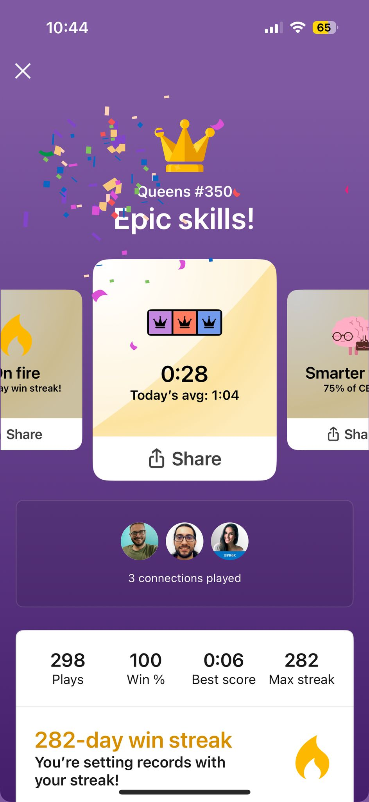
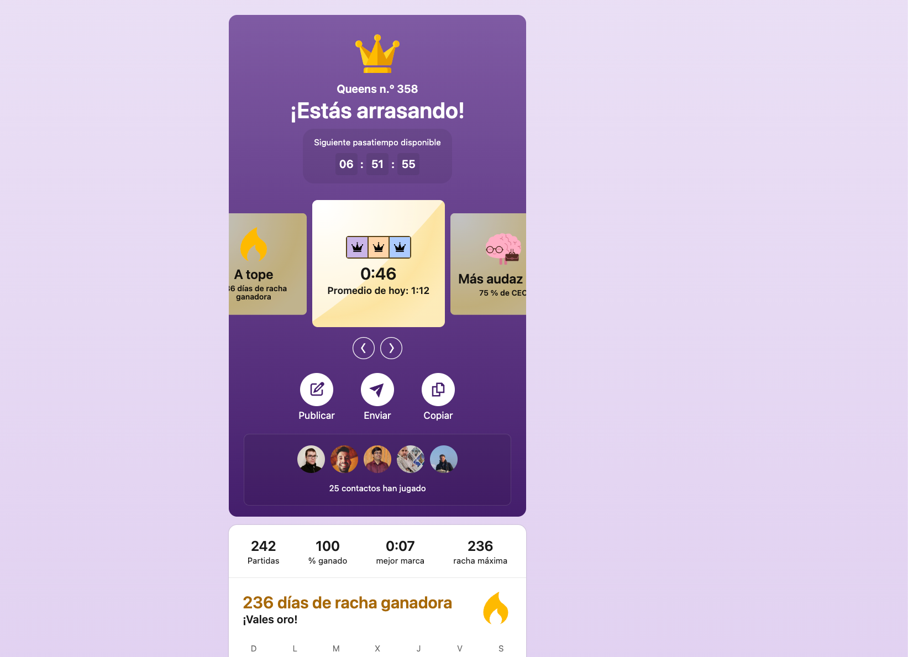

# 🤖 LDRBot

 
 

---

## 💡 Overview

**LDRBot** stands for **LinkedIn Daily (games) Ranking Bot** — a Telegram bot that automates score tracking and leaderboard generation
for [LinkedIn’s daily puzzle games](https://www.linkedin.com/games) (
currently, [Queens](https://www.linkedin.com/games/queens), [Tango](https://www.linkedin.com/games/tango), [Zip](https://www.linkedin.com/games/zip),
and [Crossclimb](https://www.linkedin.com/games/crossclimb)).

Each Telegram group becomes its own independent competition; Members submit their puzzle results by uploading screenshots, and LDRBot uses OCR to extract solving times and build a
daily ranking automatically.

## 🦾 Try It Out

Add LDRBot to your Telegram group: [@LinkedinDailyRankingBot](https://t.me/LinkedinDailyRankingBot)

Each group is treated as a standalone competition — just invite the bot to your group and you’re ready to go!

## ⚙️ How It Works

When you add LDRBot to a Telegram group, that group becomes its own independent leaderboard and competition space. Each day, members of the group can submit their results for
LinkedIn’s puzzles (currently: Queens, Tango, Zip and Crossclimb) by simply uploading a screenshot of their completion screen.

LDRBot automatically scans these screenshots using OCR (powered by OpenCV and Tesseract) and extracts the relevant information: the game type and the time it took to solve it. Once
processed, your time is recorded for the current day and associated with your Telegram user ID.

As group members submit their scores, LDRBot keeps track of who’s already participated and waits for everyone to submit. Once all registered players have sent their times, it
automatically recalculates and publishes the daily leaderboard. Alternatively, any member can run the /ranking command to manually trigger a recalculation at any time.

If not everyone submits, LDRBot will still calculate and publish the results at the end of the day, including only the times that were received. This ensures the competition
continues smoothly even if someone forgets to post their score.

Each group maintains its own isolated set of scores, players, and competition history — meaning users can participate in multiple groups independently. Leaderboards reset daily, so
every new day is a fresh challenge for members to compete, improve, and (hopefully) brag.

> [!NOTE]
> Only **group messages** with commands or screenshots are processed.  
> Private message support is under development.

## 🖼️ Screenshots

LDRBot uses OCR to read your submitted screenshots and extract the game and solving time.  
For best results, try to capture the colored square that shows the game result **as clearly as possible**, and avoid overlays like confetti or cropped
images.

### Mobile Layout Examples

  
  &nbsp;
  
  &nbsp;
  

### Desktop Layout Examples

  
  &nbsp;
  
  &nbsp;
  

## 🛠️ Commands

| Command                               | Description                                                                                                                                |
|---------------------------------------|--------------------------------------------------------------------------------------------------------------------------------------------|
| `/games`                              | Lists the games being tracked by the bot.                                                                                                  |
| `/delete <game>`                      | Removes your score for today's selected game.                                                                                              |
| `/deleteAll`                          | Removes all of your submitted results for the current day.                                                                                 |
| `/override @<username> <game> <time>` | Admin only: Override today's user time (`mm:ss`) for a given game.                                                                         |
| `/ranking`                            | Calculates and displays the current leaderboard for the group. It will be recalculated automatically after all members submit their times. |
| `/configure`                          | Configure bot settings such as the tracked games or the group timezone.                                                                    |
| `/cancel`                             | Aborts the current configuration operation.                                                                                                |
| `/about`                              | Displays information about the bot and its creator.                                                                                        |
| `/help`                               | Displays a list of available commands and usage instructions.                                                                              |

## 🚀 Getting Started

### Requirements

- A Telegram account
- A Telegram group where you have permission to add bots

### Setup

1. **Add the bot to your group**  
   LDRBot will start tracking scores and players from the moment it's added.

3. **Configure the bot (optional)**  
   By default the bot will track all games supported. Admins can use `/configure` to choose what to track as well as configure other bot settings.

3. **Submit your LinkedIn score screenshot**  
   LDRBot will extract your time and game, and track it for the day.

4**Manage your score (optional)**  
Use `/delete`, `/deleteall`, or `/override` (admin-only) to modify the results if needed. Useful for correcting misprocessed or mistaken submissions.

5**Watch the leaderboard evolve**  
Once everyone submits (or at day’s end), LDRBot will post the updated rankings.

## 💻 Tech Stack

- **Language**: Java 21
- **OCR Engine**: [Tesseract](https://github.com/tesseract-ocr/tesseract) via [Tess4J](https://github.com/nguyenq/tess4j)
- **Image Processing**: [OpenCV](https://github.com/opencv/opencv) via [Bytedeco](https://github.com/bytedeco)
- **Frameworks**: [Spring Boot](https://github.com/spring-projects/spring-boot) + [TelegramBots](https://github.com/rubenlagus/TelegramBots)

## 🔮 Future Features

- [ ] Allow to opt-in/out of reminders and configure time
- [x] Auto-finalize scores at end-of-day, even if some users didn’t submit
- [x] Allow to opt-in/out from games on each group
- [ ] Support for private chat submissions (auto-publish to all groups the user is in)
- [ ] Web dashboard showing historical and aggregated performance across groups and users

## 🤝 Contributing

We’d love your help to improve LDRBot!

Whether you're here to fix a bug, suggest a feature, or simply explore how it works, here’s how to get involved:

1. ⭐ **Star this repository** to show support
2. 🐞 **Report issues** or request features via [GitHub Issues](https://github.com/rubasace/ldrbot/issues)
3. 🛠️ **Submit a pull request** with enhancements, fixes, or new ideas
4. 📣 **Spread the word** — share it with your Telegram puzzle groups!

## 💖 Support LDRBot

LDRBot is free and open-source. If it's useful for your group, consider supporting its development!

## 📄 License

This project is licensed under the [MIT License](LICENSE).