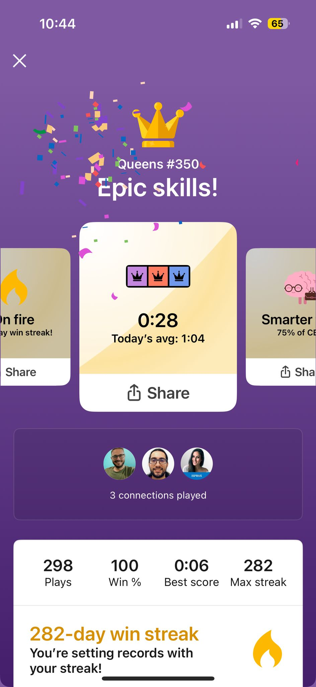
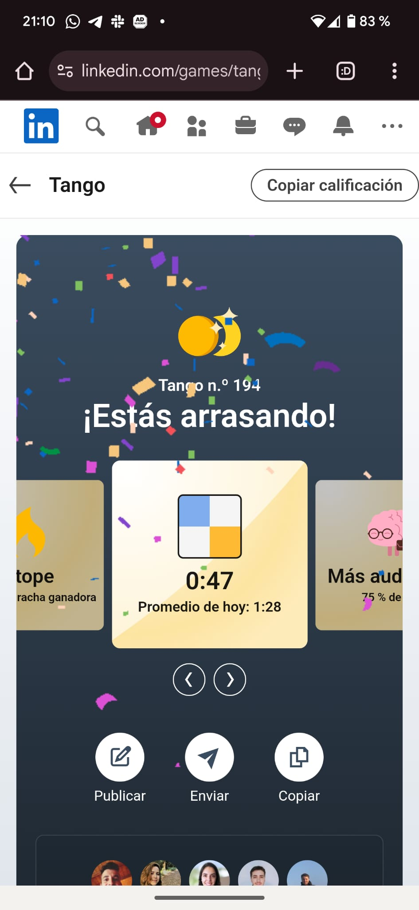
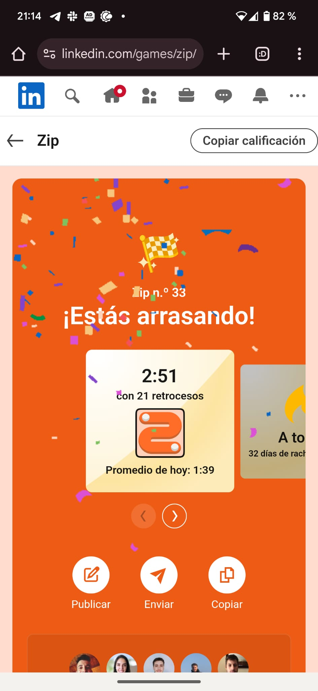
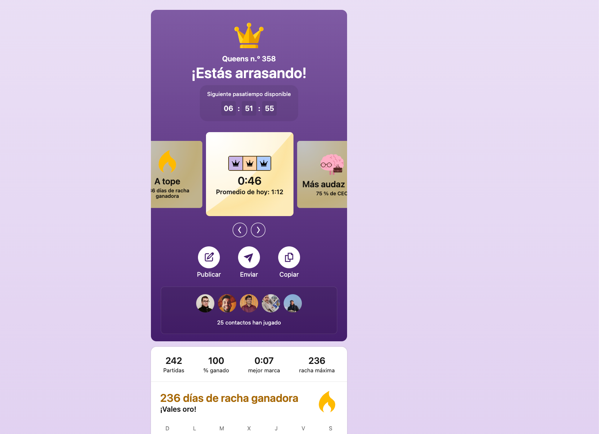
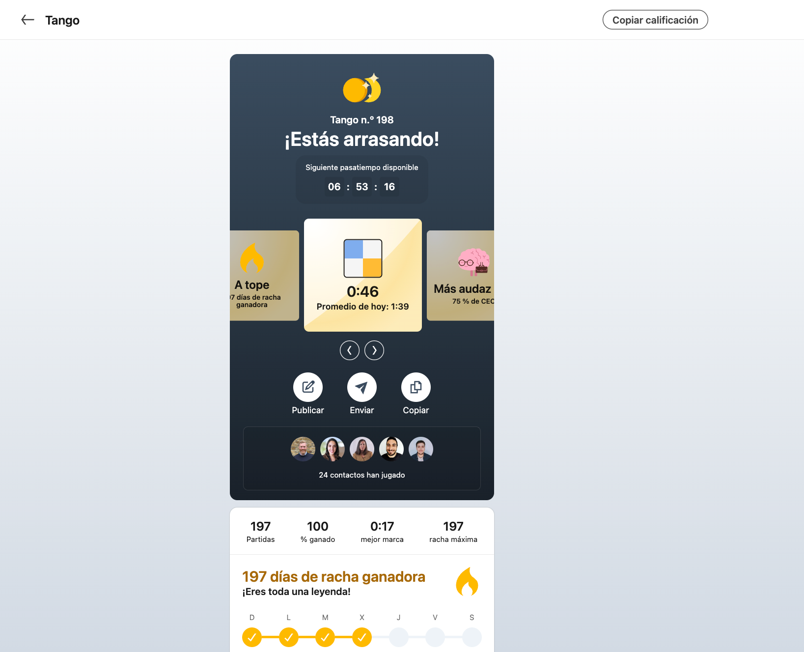
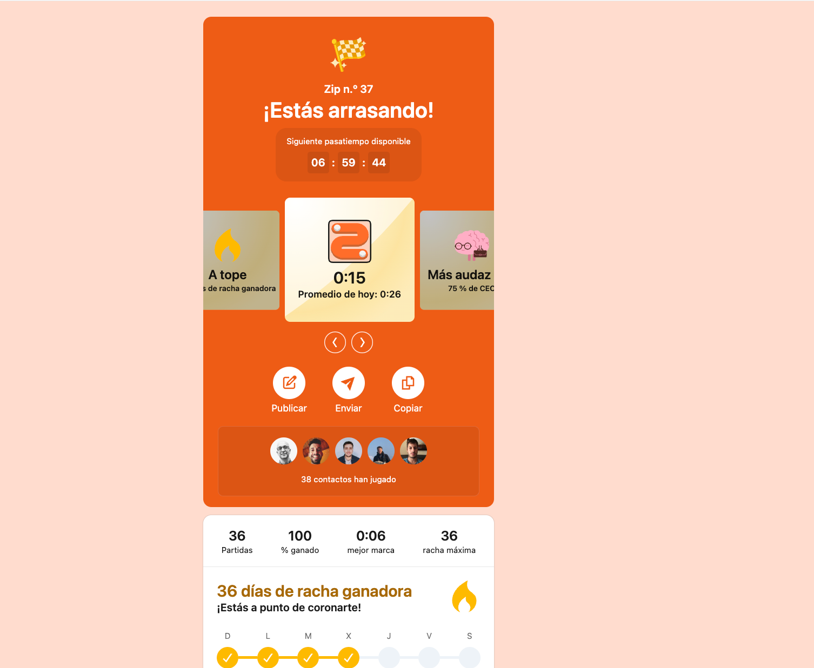

# 🤖 LDRBot

 
 

---

## 💡 Overview

**LDRBot** stands for **LinkedIn Daily (games) Ranking Bot** — a Telegram bot that automates score tracking and
leaderboard generation
for [LinkedIn's daily puzzle games](https://www.linkedin.com/games) (
currently, [Queens](https://www.linkedin.com/games/queens), [Tango](https://www.linkedin.com/games/tango), [Zip](https://www.linkedin.com/games/zip),
[Crossclimb](https://www.linkedin.com/games/crossclimb), [Mini Sudoku](https://www.linkedin.com/games/mini-sudoku),
and [Patches](https://www.linkedin.com/games/patches)).

Each Telegram group becomes its own independent competition. Members can submit their puzzle results either by uploading
screenshots or by sharing the result message directly from LinkedIn. LDRBot uses OCR to extract solving times from
images to build a daily ranking automatically. Alternatively, it can parse the shared text.

## 🦾 Try It Out

Add LDRBot to your Telegram group: [@LinkedinDailyRankingBot](https://t.me/LinkedinDailyRankingBot)

Each group is treated as a standalone competition — just invite the bot to your group and you’re ready to go!

## ⚙️ How It Works

When you add LDRBot to a Telegram group, that group becomes its own independent leaderboard and competition space. Each
day, members of the group can submit their results for
LinkedIn's puzzles (currently: Queens, Tango, Zip, Crossclimb, Mini Sudoku, and Patches) in two ways:

1. **Upload a screenshot** of the completion screen — LDRBot uses OCR (powered by OpenCV and Tesseract) to automatically
   scan and extract the game type and solving time.
2. **Share the result message** directly from LinkedIn — LDRBot parses the text to extract the same information.

Once processed, the time is recorded for the current day and associated with the correspondent Telegram user ID.

As group members submit their scores, LDRBot keeps track of who’s already participated and waits only for the players
taking part. Once all of them have sent their times, it
automatically recalculates and publishes the daily leaderboard. Alternatively, any member can run the /ranking command
to manually trigger a recalculation at any time.

Anyone who is away for a while can be parked by an admin from /configure. A parked player is not waited for, is not
reminded, and is not counted when points are awarded, so the rest of the group keeps competing without them. Nothing of
theirs is deleted, and they start taking part again on their own the next time they submit a result.

If not everyone submits, LDRBot will still calculate and publish the results at the end of the day, including only the
times that were received. This ensures the competition
continues smoothly even if someone forgets to post their score.

Each group maintains its own isolated set of scores, players, and competition history — meaning users can participate in
multiple groups independently. Leaderboards reset daily, so
every new day is a fresh challenge for members to compete, improve, and (hopefully) brag.

> [!NOTE]
> Only **group messages** with commands or screenshots are processed.  
> Private message support is under development.

## 🖼️ Screenshots

LDRBot uses OCR to read your submitted screenshots and extract the game and solving time.
For best results, try to capture the colored square that shows the game result **as clearly as possible**, and avoid
overlays like confetti or cropped
images.

### Mobile Layout Examples

  
  &nbsp;
  
  &nbsp;
  

### Desktop Layout Examples

  
  &nbsp;
  
  &nbsp;
  

## 🛠️ Commands

| Command      | Description                                                                                                                                |
|--------------|--------------------------------------------------------------------------------------------------------------------------------------------|
| `/games`     | Lists the games being tracked by the bot.                                                                                                  |
| `/delete`    | Removes your score for today's selected game.                                                                                              |
| `/deleteAll` | Removes all of your submitted results for the current day.                                                                                 |
| `/override`  | Admin only: Override a user’s time for a given game. Optionally specify a date to backfill a past record.                                  |                                                                     |
| `/ranking`   | Calculates and displays the current leaderboard for the group. It will be recalculated automatically after all members submit their times. |
| `/configure` | Configure bot settings such as the tracked games, the group timezone, or which players are taking part.                                    |
| `/cancel`    | Aborts the current configuration operation.                                                                                                |
| `/about`     | Displays information about the bot and its creator.                                                                                        |
| `/help`      | Displays a list of available commands and usage instructions.                                                                              |

## 🚀 Getting Started

### Requirements

- A Telegram account
- A Telegram group where you have permission to add bots

### Setup

1. **Add the bot to your group**  
   LDRBot will start tracking scores and players from the moment it's added.

3. **Configure the bot (optional)**  
   By default the bot will track all games supported. Admins can use `/configure` to choose what to track as well as
   configure other bot settings.

3. **Submit your LinkedIn score**  
   Upload a screenshot or share the result message from LinkedIn. LDRBot will extract your time and game, and track it
   for the day.

4. **Manage your score (optional)**  
   Use `/delete`, `/deleteall`, or `/override` (admin-only) to modify the results if needed. Useful for correcting
   misprocessed or mistaken submissions.

5. **Watch the leaderboard evolve**  
   Once everyone submits (or at day's end), LDRBot will post the updated rankings.

## 💻 Tech Stack

- **Language**: Java 21
- **OCR Engine**: [Tesseract](https://github.com/tesseract-ocr/tesseract)
  via [Tess4J](https://github.com/nguyenq/tess4j)
- **Image Processing**: [OpenCV](https://github.com/opencv/opencv) via [Bytedeco](https://github.com/bytedeco)
- **Frameworks
  **: [Spring Boot](https://github.com/spring-projects/spring-boot) + [TelegramBots](https://github.com/rubenlagus/TelegramBots)

## 🔮 Future Features

- [ ] Allow to opt-in/out of reminders and configure time
- [x] Auto-finalize scores at end-of-day, even if some users didn’t submit
- [x] Allow to opt-in/out from games on each group
- [ ] Support for private chat submissions (auto-publish to all groups the user is in)
- [ ] Web dashboard showing historical and aggregated performance across groups and users

## 🤝 Contributing

We’d love your help to improve LDRBot!

Whether you're here to fix a bug, suggest a feature, or simply explore how it works, here’s how to get involved:

1. ⭐ **Star this repository** to show support
2. 🐞 **Report issues** or request features via [GitHub Issues](https://github.com/rubasace/ldrbot/issues)
3. 🛠️ **Submit a pull request** with enhancements, fixes, or new ideas
4. 📣 **Spread the word** — share it with your Telegram puzzle groups!

## 💖 Support LDRBot

LDRBot is free and open-source. If it's useful for your group, consider supporting its development!

## 📄 License

This project is licensed under the [MIT License](LICENSE).